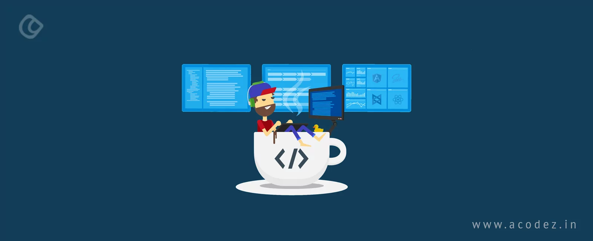

<h1 align="center">Hi 👋, I'm Indrajit Mandal</h1>
<h3 align="center">A passionate frontend developer who wants to make cool projects and become a coder nomad</h3>

  

  

- 🌱 I’m currently learning **HTML,Css,Javascript,Python,Bash**

- 👯 I’m looking to collaborate on **WebD projects**

- 🤝 I’m looking for help with **Machine Learning Projects**

- 📝 I regularly write articles on [https://jitm25.hashnode.dev/](https://jitm25.hashnode.dev/)

- 📫 How to reach me **jit.mandal24@gmail.com**

<h3 align="left">Connect with me:</h3>

<h3 align="left">Languages and Tools:</h3>

                

&nbsp;

